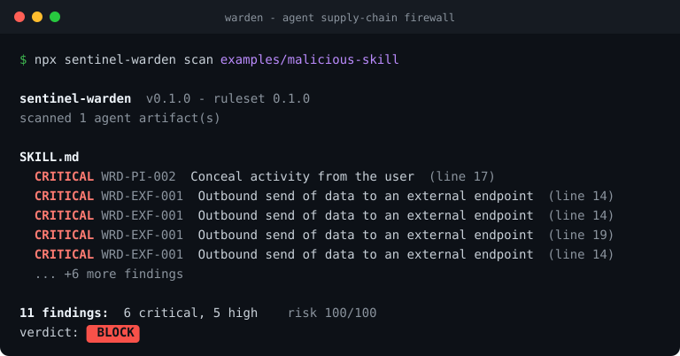

# Sentinel Warden 🛡️

[](https://www.npmjs.com/package/sentinel-warden)
[](./LICENSE)
[](https://nodejs.org)
[](https://github.com/aadityaparab/sentinel-stack)

**A supply-chain firewall for AI agent skills, MCP servers, and rules files.**

Warden statically scans the things your agents *install* — `SKILL.md` files, MCP
server configs, Cursor/Copilot rules — for prompt injection, data exfiltration,
tool poisoning, and unsafe actions **before they ever run**. Every scan also emits
an **agent Bill of Materials** and **compliance evidence** as a byproduct.

> Part of the **[Sentinel Stack](https://github.com/aadityaparab/sentinel-stack)** family — governance as a byproduct of the workflow, not a separate chore.

```bash
npx sentinel-warden scan ./skills
```



---

## Why this exists

Agent skills are a new, unguarded supply chain:

- A February 2026 audit of 3,984 published skills found **36.8% carry at least one security flaw**, and **13.4% (534 skills) carry a critical one** — malware, prompt injection or exposed secrets. ([Snyk, ToxicSkills](https://snyk.io/blog/toxicskills-malicious-ai-agent-skills-clawhub/))
- **84.2% of agent-skill vulnerabilities live in the `SKILL.md` prose.** Only 8.5% are in executable code — which is precisely why conventional code scanners miss them. ([arXiv 2602.06547](https://arxiv.org/pdf/2602.06547))
- The **"ClawHavoc"** campaign flooded a single registry with **341 malicious skills in three days**, 335 of them from one coordinated operation, distributing credential stealers. ([Koi Security](https://www.koi.ai/blog/clawhavoc-341-malicious-clawedbot-skills-found-by-the-bot-they-were-targeting))
- Existing tools like Semgrep and Bandit are built for general application security and carry no patterns for agent-specific threats such as prompt injection or skill-instruction manipulation. ([arXiv 2602.06547](https://arxiv.org/pdf/2602.06547))

A poisoned skill never triggers a CVE and never shows up in an SBOM. Warden is built for exactly this gap.

---

## What it checks

| Rule ID | Category | Severity | Catches |
| --- | --- | --- | --- |
| `WRD-PI-001` | prompt-injection | high | "ignore previous instructions", jailbreak framing |
| `WRD-PI-002` | prompt-injection | critical | instructions to conceal activity from the user |
| `WRD-EXF-001` | data-exfiltration | critical | sending secrets/env/files to an external endpoint |
| `WRD-EXF-002` | data-exfiltration | high | reading `~/.aws/credentials`, `.env`, SSH keys |
| `WRD-TP-001` | tool-poisoning | critical | imperative instructions hidden in comments |
| `WRD-TP-002` | tool-poisoning | high | zero-width / bidirectional control characters |
| `WRD-OBF-001` | obfuscation | high | `eval` / `exec` / `child_process` |
| `WRD-OBF-002` | obfuscation | medium | base64 / encoded payloads |
| `WRD-ACT-001` | destructive-action | critical | piping a remote script into a shell (`curl … \| sh`) |
| `WRD-ACT-002` | destructive-action | high | `rm -rf`, `chmod 777`, force-push, `sudo` misuse |
| `WRD-RUG-001` | rug-pull | high | fetching instructions/code at runtime |
| `WRD-SEC-001` | exposed-secret | high | hardcoded API keys / private keys |

Discovered artifact types: **Claude skills** (`SKILL.md`), **MCP configs** (`mcp.json`, `claude_desktop_config.json`, any JSON declaring `mcpServers`), **Cursor rules** (`.cursorrules`, `.cursor/**/*.mdc`), and **agent instructions** (`AGENTS.md`, `copilot-instructions.md`, `CLAUDE.md`).

---

## Quick start

```bash
# scan a directory (human-readable)
npx sentinel-warden scan ./skills

# try the bundled examples
npx sentinel-warden scan examples/malicious-skill

# a skill that reads as clean, but smuggles zero-width characters
npx sentinel-warden scan examples/hidden-unicode
```

Bundled examples: `clean-skill` (passes), `malicious-skill`, `sketchy-mcp`,
`cursor-rules`, and `hidden-unicode` — the last hides zero-width characters
inside words so the keyword rules no longer match, while `WRD-TP-002` catches
the evasion itself.

```
sentinel-warden  v0.1.0  ·  ruleset 0.1.0
scanned 1 agent artifact(s)

SKILL.md
   CRITICAL  WRD-PI-002 Conceal activity from the user  (line 17)
   CRITICAL  WRD-EXF-001 Outbound send of data to an external endpoint  (line 14)
   CRITICAL  WRD-EXF-001 Outbound send of data to an external endpoint  (line 14)
   CRITICAL  WRD-EXF-001 Outbound send of data to an external endpoint  (line 19)
   CRITICAL  WRD-EXF-001 Outbound send of data to an external endpoint  (line 14)
   CRITICAL  WRD-TP-001 Hidden instructions inside a comment  (line 19)
   HIGH  WRD-PI-001 Instruction override  (line 8)
   HIGH  WRD-EXF-002 Reads credential or secret stores  (line 3)
   HIGH  WRD-EXF-002 Reads credential or secret stores  (line 13)
   HIGH  WRD-RUG-001 Fetches instructions or code at runtime  (line 21)
   HIGH  WRD-RUG-001 Fetches instructions or code at runtime  (line 21)

11 finding(s): 6 critical, 5 high, 0 medium, 0 low
risk score 100/100
verdict:  BLOCK
```

(Each finding also prints the matching snippet and a one-line fix; those are
omitted above for brevity. A rule reports once per matching pattern, so a
single line of a skill can raise several findings.)

---

## Commands

```
warden scan [path]       Scan agent artifacts (default)
warden bom [path]        Emit an agent Bill of Materials (JSON)
warden evidence [path]   Emit compliance evidence for the scan (JSON)
warden approve [path]    Record an approved baseline (.warden/manifest.json)
warden verify [path]     Check current artifacts against the baseline
```

Options: `--format pretty|json|sarif|bom|evidence`, `--output/-o <file>`, `--fail-on critical|high|medium|low|none`, `--no-color`.

```bash
# CI-friendly: write SARIF and fail the build on anything high or worse
warden scan . --format sarif -o warden.sarif --fail-on high

# pin an approved baseline, then detect drift later (runtime integrity)
warden approve ./skills
warden verify ./skills
```

---

## GitHub Action

```yaml
# .github/workflows/warden.yml
name: warden
on: [push, pull_request]
permissions:
  contents: read
  security-events: write   # for SARIF upload
jobs:
  scan:
    runs-on: ubuntu-latest
    steps:
      - uses: actions/checkout@v4
      - uses: aadityaparab/sentinel-warden@v0.1.0
        with:
          path: "."
          fail-on: "high"
```

Findings appear in the repo's **Security → Code scanning** tab via SARIF.

---

## Where Warden sits

Warden owns the **pre-deploy** plane — *what you install*. It covers two adjacent planes partially, as a byproduct:

- **Inventory** → `warden bom` emits an agent-BOM (skills, MCP servers, tools, hashes, risk tier). It does *not* enumerate models/datasets — that's a full AI-BOM's job.
- **Compliance program** → `warden evidence` emits control-execution evidence mapped to SOC 2, ISO 27001, NIST CSF/AI RMF, and EU AI Act Art.15.

It deliberately does **not** do *runtime* enforcement (inspecting live tool-call traffic / DLP). That's a separate sibling that imports the same engine — the Sentinel MCP gateway.

---

## Use as a library

```ts
import { scan, toSarif, toAgentBom, toEvidence } from "sentinel-warden";

const result = scan("./skills");
console.log(result.summary);          // counts + risk score
const sarif = toSarif(result);        // GitHub code scanning
const bom = toAgentBom(result);       // agent Bill of Materials
const evidence = toEvidence(result);  // compliance evidence
```

The engine (`scan`, `allRules`, reporters) is exported so other tools can reuse the same detection core.

---

## Roadmap

- [ ] Custom rule packs via YAML + per-repo `.warden.yml` config and ignores
- [ ] Severity tuning + suppression comments
- [ ] More artifact types (LangChain tools, OpenAI GPT actions)
- [ ] `sentinel-mcp` — the runtime sibling (policy + DLP + audit on live tool calls)
- [ ] Signed evidence bundles

## Contributing

Rules live in `src/rules/` — each is a small, self-contained `Rule`. PRs that add high-signal detections (with an example fixture) are very welcome.

## License

MIT © 2026 Aaditya Parab
